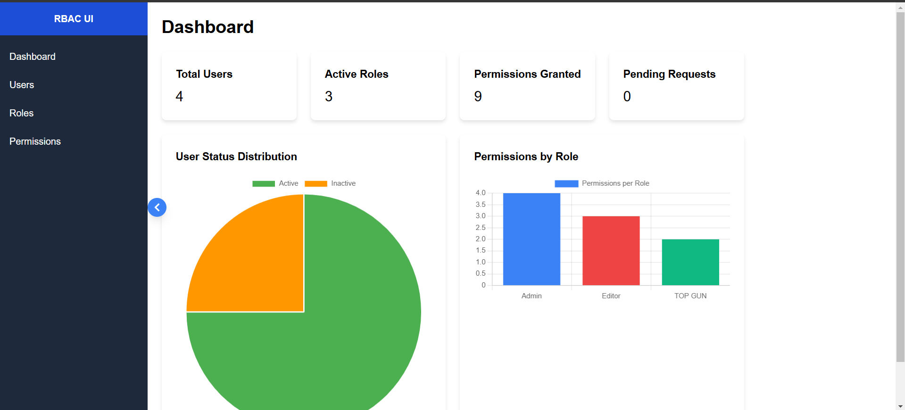
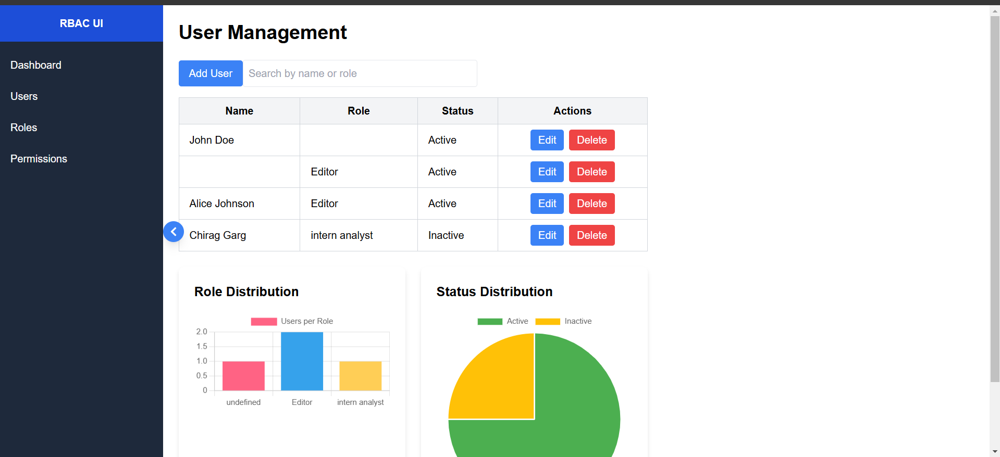
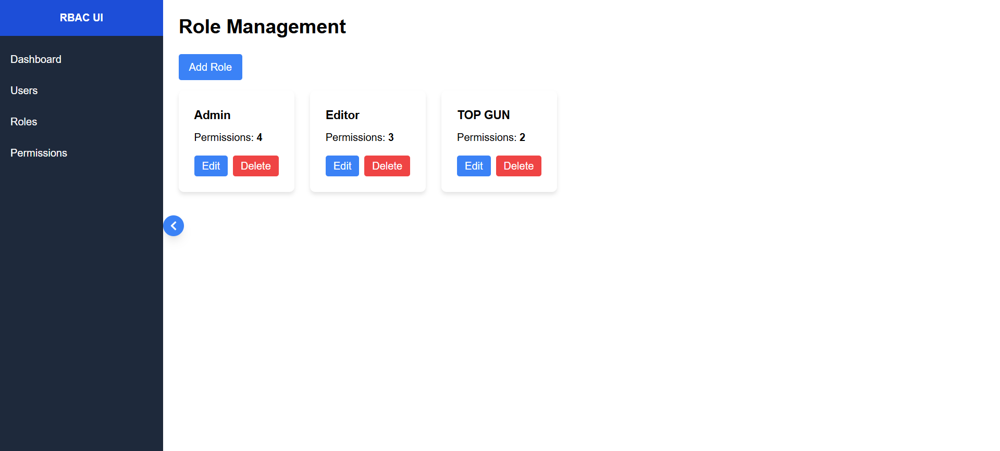
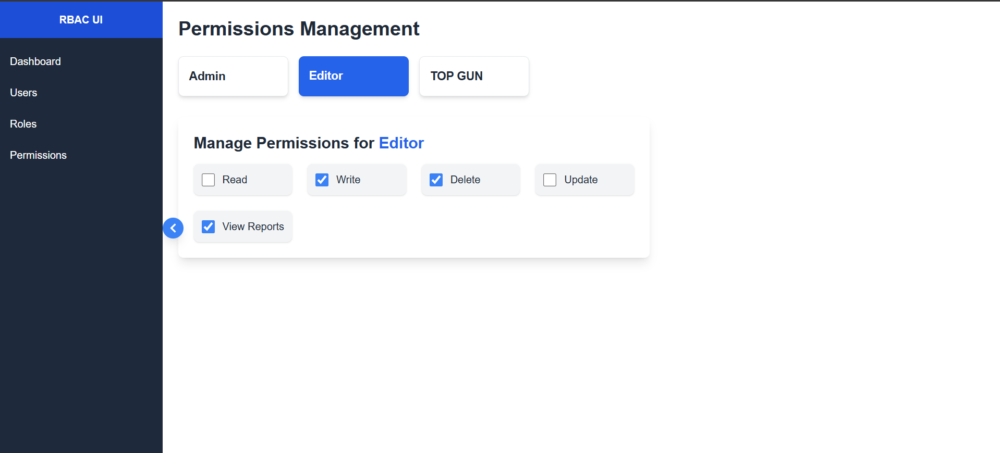

```markdown
# **RBAC UI - Role-Based Access Control**

This project is a **Role-Based Access Control (RBAC)** UI, built to manage users, roles, and permissions within an application. It allows administrators to create, manage, and modify users, assign roles, and manage permissions for various roles in the system.

## **Features**
- **User Management**: Create, edit, delete, and search users.
- **Role Management**: Add, update, delete roles, and assign them to users.
- **Permissions Management**: Assign permissions like Read, Write, Delete, etc., to roles.
- **Charts and Analytics**: View user distribution based on roles and status.

---

## **Technologies Used**

- **Frontend**: React.js, TailwindCSS
- **Charts**: React-Chartjs-2 (Pie, Bar charts)
- **Backend**: JSON Server for mock backend (using `http://localhost:5000`)
- **Authentication (Optional)**: JWT (JSON Web Tokens) for secure authentication.

---

## **Project Setup**

### 1. **Clone the Repository**
```bash
git clone git@github.com:CHIRAG-DID-THIS/VRV_ASSIGNMENT.git
cd VRV_ASSIGNMENT
```

### 2. **Install Dependencies**
Make sure you have **Node.js** installed. Then, run the following commands to install the required dependencies.

For the frontend:
```bash
npm install
```

For the backend (if using a mock API with JSON Server):
```bash
cd server
npm install
```

### 3. **Start the Development Server**

For the frontend:
```bash
npm start
```
This will start the app at [http://localhost:3000](http://localhost:3000).

For the backend:
```bash
npm run server
```
This will start the mock backend at [http://localhost:5000](http://localhost:5000).

---

## **Screenshots**

Here are a few screenshots demonstrating the project in action:

### 1. Dashboard

*Figure 1: Dashboard showing user stats and charts.*

### 2. User Management

*Figure 2: User management page showing the user list and actions.*

### 3. Role Management

*Figure 3: Role management page with a list of roles and their associated actions.*

### 4. Permissions Management

*Figure 4: Permissions management page where roles can be assigned specific permissions.*

---

## **API Documentation**

### **Users**
- **GET /users**: Fetch all users
- **POST /users**: Create a new user
- **PUT /users/:id**: Update an existing user by ID
- **DELETE /users/:id**: Delete a user by ID

### **Roles**
- **GET /roles**: Fetch all roles
- **POST /roles**: Create a new role
- **PUT /roles/:id**: Update an existing role by ID
- **DELETE /roles/:id**: Delete a role by ID

### **Permissions**
- **GET /permissions**: Fetch all permissions
- **POST /permissions**: Create new permissions (if applicable)

---

## **Deployment Instructions**

### **Frontend Deployment (Netlify)**

1. **Create an Account on Netlify**:
   Go to [Netlify](https://www.netlify.com/) and create an account.

2. **Link GitHub Repository to Netlify**:
   - On your Netlify dashboard, click **"New Site from Git"**.
   - Connect your GitHub repository with Netlify and select the branch to deploy (usually `main`).

3. **Deploy**:
   Once connected, Netlify will automatically detect the build settings and deploy your site. It will use `npm run build` for the production build and deploy it.

4. **Access Your Site**:
   After the deployment, you'll get a URL to access your live site.


## **How to Contribute**

We welcome contributions! Please fork this repository, create a branch for your feature, and submit a pull request. You can contribute in the following ways:
- Report bugs and create issues
- Add new features
- Improve documentation

---

## **License**

This project is licensed under the MIT License - see the [LICENSE](LICENSE) file for details.

---

## **Authors**

- **Your Name**: [GitHub Profile](https://github.com/CHIRAG-DID-THIS)
---

